Helm Charts GitHub Pages
-------------------------
## Package the Helm Chart
```sh
helm package <chart-directory>
```
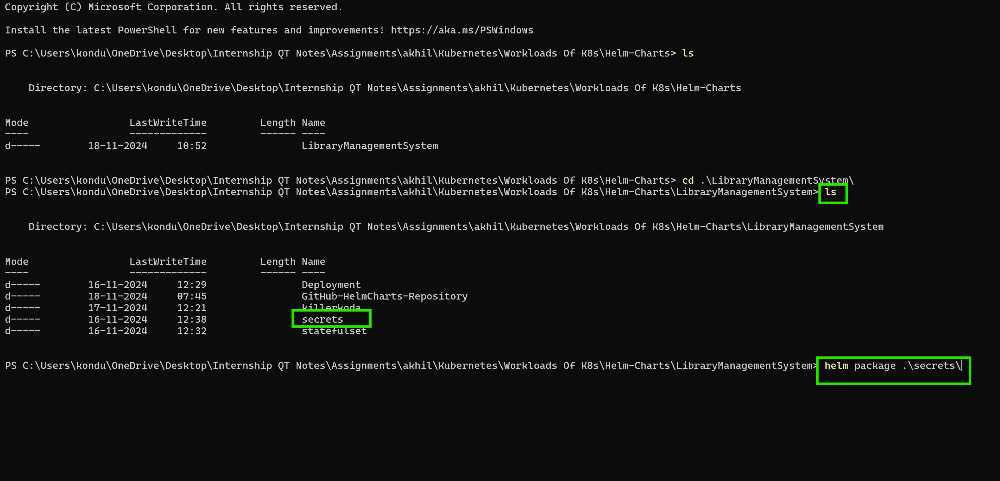
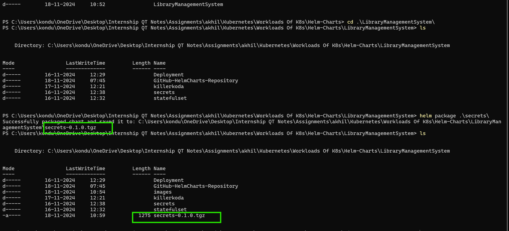
## copy the .tgz file to GitHub pages repository 
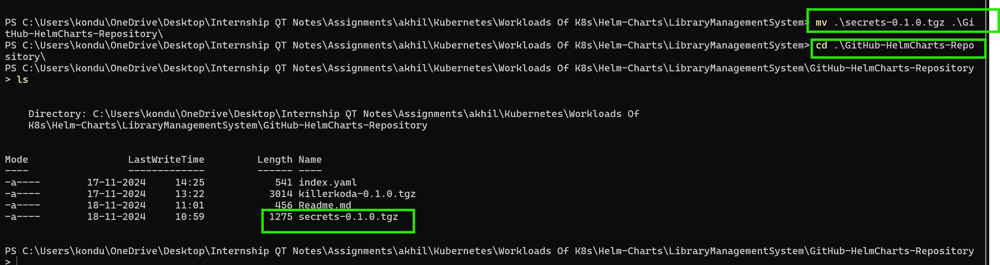
##  Generate the Helm Repository Index
* Use helm repo index to generate an index.yaml file. This file contains metadata for your Helm repository.
```sh
helm repo index . --url https://konduriakhil.github.io/GitHub-HelmCharts-Repository
```
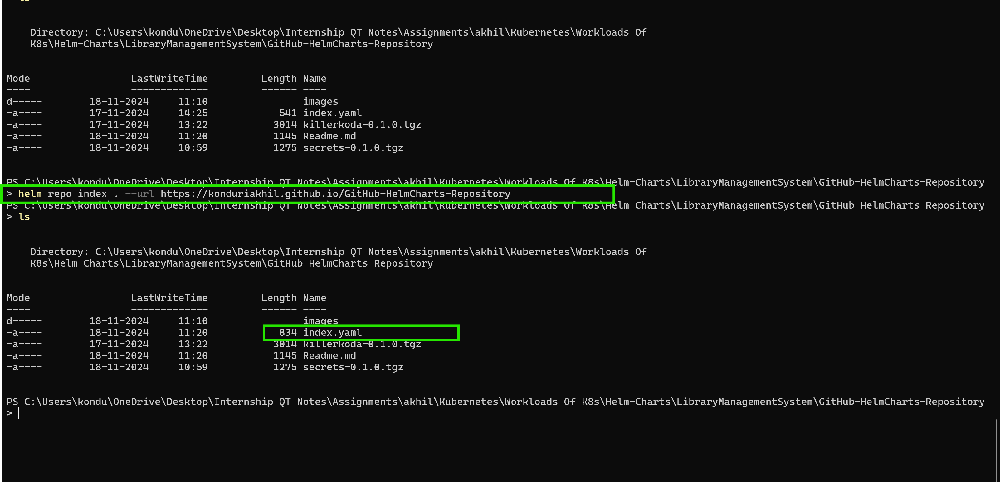
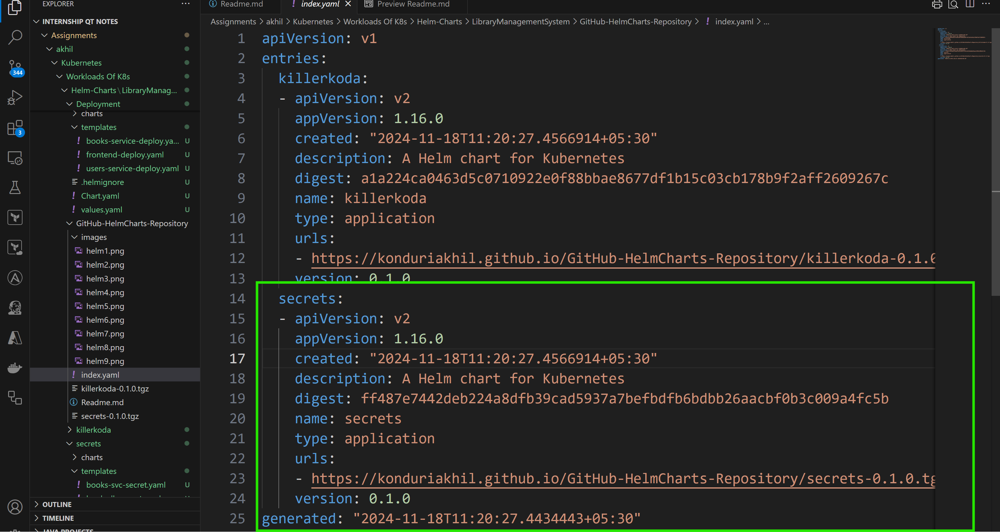
## Change the Git Hub repository to GitHub Pages for the accomodation of the Helm charts
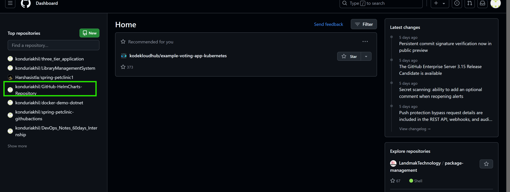
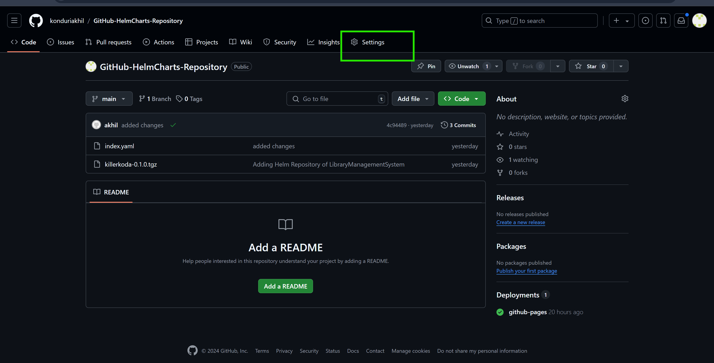
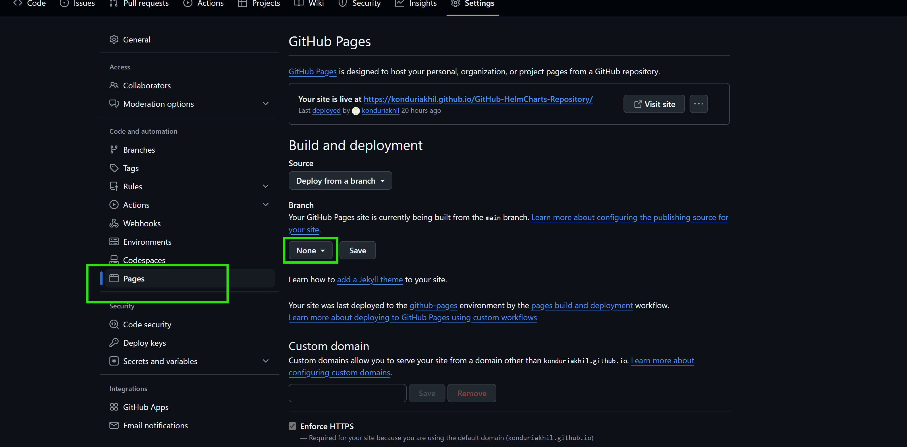
  ### Change the Branch to main
  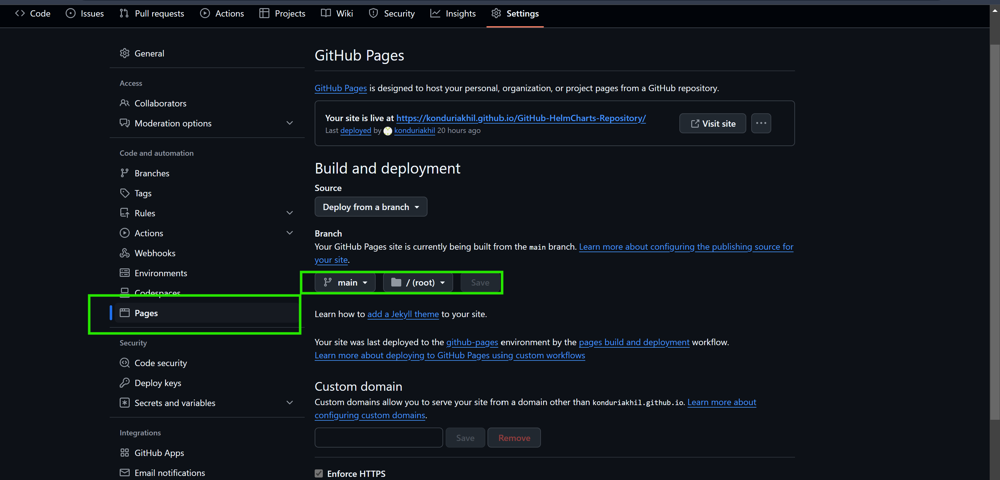

## Push these changes to the GitHub Pages repository
```sh
git add .
git commit -m "push the secrets to GitHub Pages"
git push
```
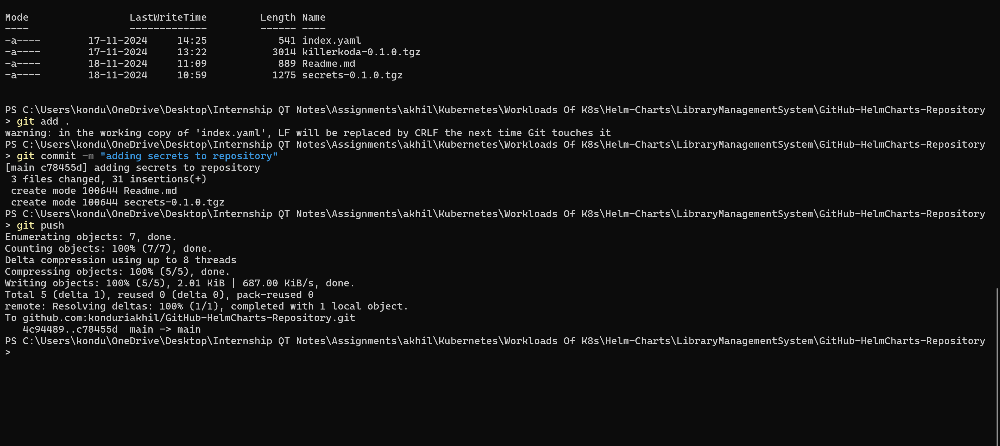
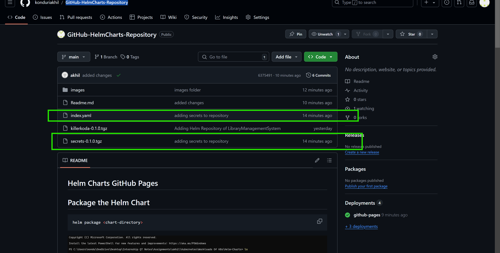
## Adding the repository of charts to Other machine to use charts
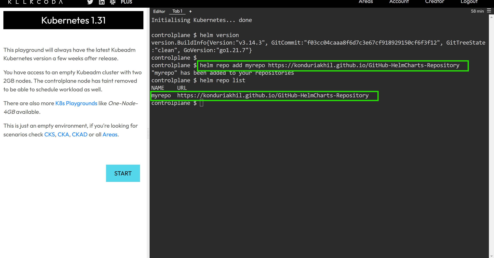
```sh
# Adding the repository
helm repo add myrepo https://konduriakhil.github.io/GitHub-HelmCharts-Repository

# Update the repository
helm repo update myrepo

# List the repositories
helm repo list

# To search available charts in a repository
helm search repo myrepo
```
## Deploy the helm chart
```sh
# helm install <release-name> myrepo/<chart-name>
helm install app1 myrepo/secrets
```
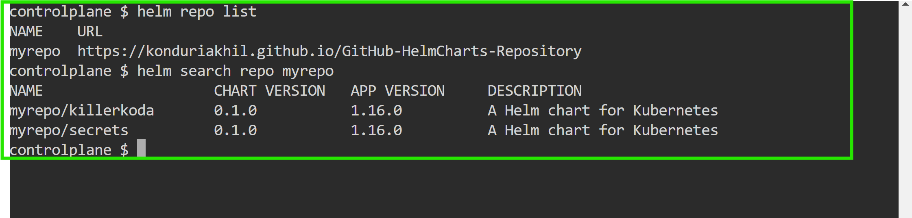
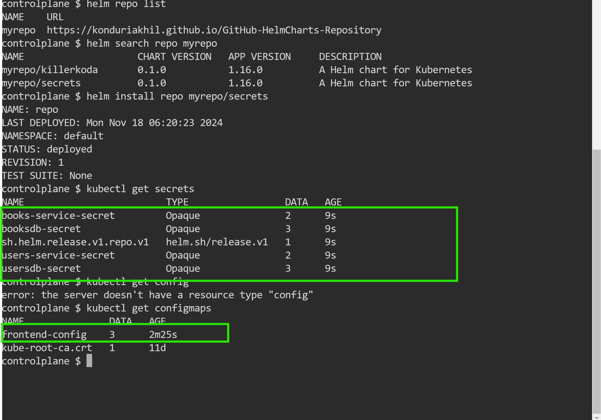